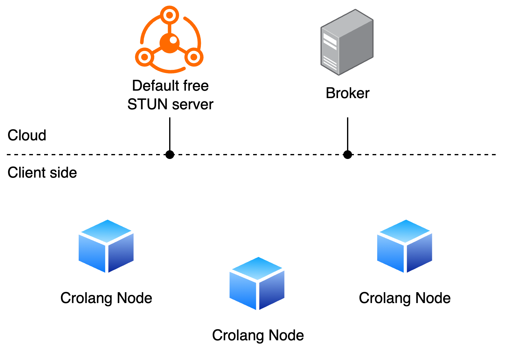
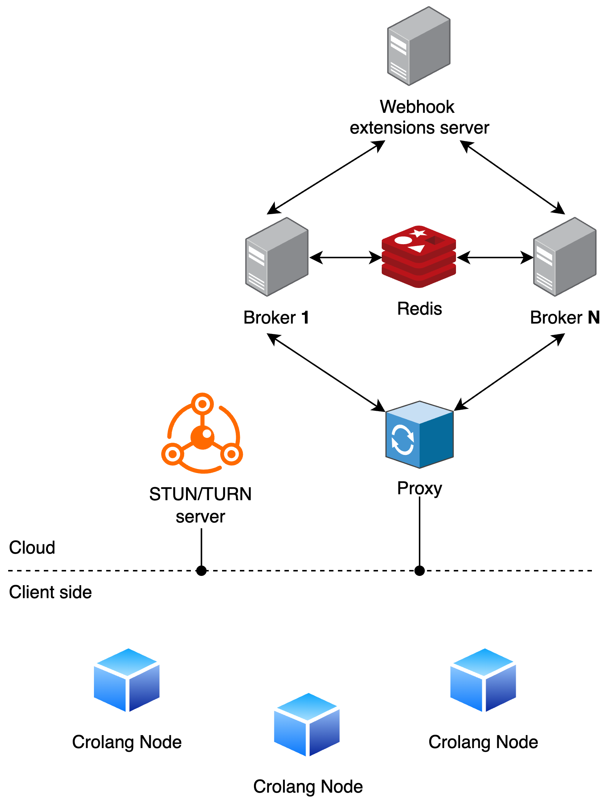

# crolang-p2p-broker
The official implementation of the Broker in the Crolang project.

## Table of contents
- [The CrolangP2P Project](#the-crolangp2p-project)
- [What does the Broker do](#what-does-the-broker-do)
- [Run the Broker](#run-the-broker)
  - [With Docker](#with-docker)
  - [From source code](#from-source-code)
- [Connecting a Crolang Node to the Broker](#connecting-a-crolang-node-to-the-broker)
- [Message exchange via WebSocket](#message-exchange-via-websocket)
- [Overcoming network limitations for Node's P2P connections](#overcoming-network-limitations-for-nodes-p2p-connections)
- [Customizing Broker behaviours: Modules](#customizing-broker-behaviours-modules)
  - [Horizontal scalability](#horizontal-scalability)
  - [Nodes RTC configuration](#nodes-rtc-configuration)
  - [Nodes authentication](#nodes-authentication)
  - [Nodes connection and communication via WebSocket authorization](#nodes-connection-and-communication-via-websocket-authorization)
  - [Nodes validity through lifecycle](#nodes-validity-through-lifecycle)
  - [On authenticated socket message](#on-authenticated-socket-message)
- [Environment variables](#environment-variables)
  - [.env file](#env-file)
  - [Supported Environment Variables](#supported-environment-variables)
- [Contributing](#contributing)
- [License](#license)

## The CrolangP2P Project
[CrolangP2P](https://github.com/crolang-p2p) is a simple, robust framework for cross-language peer-to-peer (P2P) connections. Clients (“Crolang Nodes”) libraries can be easily integrated into your project and connect using only the ID of the target node, exchanging messages directly via P2P or via WebSocket using the [Crolang Broker](https://github.com/crolang-p2p/crolang-p2p-broker) as relay. The framework manages the connection and you can focus on what matters most: your project's logic.

- **Simplicity:** Minimal setup—just import the Node library, specify the peer ID, and connect.
- **Cross-language:** [Multiple Node implementations](#available-crolangp2p-node-implementations) allow seamless P2P between different languages.
- **No packet size limits:** Large data exchange is supported.
- **Extensible:** The Broker supports modular extensions for authentication, authorization, message handling, and more.

Nodes connect through the [Crolang Broker](https://github.com/crolang-p2p/crolang-p2p-broker), which acts as a rendezvous point: it helps nodes discover each other and establish direct WebRTC connections.

## What does the Broker do
The Crolang Broker is a scalable socket server that forms the backbone of the Crolang project. Nodes authenticate 
and connect to the Broker, establishing a communication channel with it.

When a Node intends to connect with another Node, the Broker facilitates the exchange of signaling messages between 
the two Nodes (which are not yet directly connected via P2P). This process enables both Nodes to gather the necessary 
information to establish a P2P connection. Essentially, the Broker acts as an intermediary for the initial handshake, 
allowing Nodes to discover each other and negotiate the parameters for a direct, peer-to-peer connection.

## Run the Broker
You can run the Crolang Broker either with Docker or directly from source code. By default, the Broker listens on port 8080. To change the port or other settings, see the [Environment variables](#environment-variables) section.

### With Docker
- **[Official image](https://hub.docker.com/r/crolangp2p/broker):**
  ```sh
  docker run -p 8080:8080 crolangp2p/broker
  ```
- **Custom build:**
  ```sh
  docker build -t crolang-broker .
  docker run -p 8080:8080 crolang-broker
  ```
- **Custom port:**
  ```sh
  docker run -p 8081:8081 -e PORT=8081 crolangp2p/broker
  ```

### From Source Code
1. Install dependencies:
   ```sh
   npm install
   ```
2. **Development mode (auto-reload):**
   ```sh
   npm run dev
   ```
3. **Production mode:**
   ```sh
   npm run build
   npm start
   ```

## Connecting a Crolang Node to the Broker
There are several different implementations in various programming languages of Crolang Nodes; check the following [list](https://github.com/crolang-p2p#available-crolangp2p-node-implementations) to see all the available implementations.

Furthermore, to get documentation on how actually to use said Nodes, check the [list of examples](https://github.com/crolang-p2p#usage-examples) using the various Crolang Node implementations.

## Message exchange via WebSocket

In addition to facilitating the negotiation and establishment of peer-to-peer (P2P) connections between nodes using WebRTC, the project also allows for traditional message exchange between peers via WebSocket, using the Broker as a relay.

This feature enables nodes to send messages to each other even without establishing a P2P connection. The broker receives the message from the sender and delivers it to the recipient, making it easy to implement classic client-server communication logic or to provide a fallback in case a direct connection cannot be established.

## Overcoming network limitations for Node's P2P connections
Crolang Nodes use [WebRTC](https://webrtc.org/) to establish P2P connections, which requires exchanging [ICE candidates](https://webrtc.org/getting-started/peer-connections?hl=en#ice_candidates) to discover viable network paths. In most cases, [STUN servers](https://www.metered.ca/tools/openrelay/stun-servers-and-friends/#what-is-a-stun-server) are sufficient to help nodes determine their public IP and traverse NATs, enabling direct connections.

However, in restrictive network environments (e.g., symmetric NATs or strict firewalls), direct P2P connections may fail. In these cases, a [TURN server](https://webrtc.org/getting-started/turn-server) is needed to relay traffic between peers, ensuring connectivity at the cost of increased latency and bandwidth usage.

- By default, the Broker provides Google's free STUN servers for basic NAT traversal.
- If your use case requires robust connectivity in restrictive networks, you can configure your own TURN server. See the [Nodes RTC configuration](#nodes-rtc-configuration) section for details on customizing STUN/TURN settings.

## Customizing Broker behaviours: Modules
The Broker supports modular extensions, allowing you to add or change features (e.g., authentication, logging, event handling) without modifying the core codebase. Modules are loaded at runtime and can be enabled, disabled, or replaced as needed.

**Benefits:**
- Keep business logic separate from the core for easier maintenance
- Add new features or integrations without touching the main server code
- Enable/disable modules based on your requirements
- Isolate customizations to avoid impacting system stability

For a complete example of module integration, see the [broker_complete_example](https://github.com/crolang-p2p/examples-crolang-p2p-broker) repository.

As far as infrastructure is concerned, when the Broker is executed without any additional module, it can be seen as shown in the following image:


While, on the other hand, the Broker uses all the modules, it can be seen as something similar to what is shown in the following image:


### Horizontal scalability
Environment variable: `REDIS_URL`

To scale the Broker horizontally (multiple instances for load balancing or high availability), set the `REDIS_URL` environment variable to connect to a Redis service. Redis is used to synchronize the state of connected Node IDs and propagate messages between all Broker instances, ensuring seamless communication regardless of which instance a Node connects to.

- **With REDIS_URL:** All Broker replicas share state and messages via Redis (recommended for production/cluster setups).
- **Without REDIS_URL:** The Broker runs in standalone mode, using only in-memory state (suitable for local development or single-instance deployments).

### Nodes RTC configuration
Environment variable: `RTC_CONFIGURATION_RESOLVER_WEBHOOK_URL`

See the [Overcoming network limitations for Node's P2P connections](#overcoming-network-limitations-for-nodes-p2p-connections) section 
for more information on why you might need to provide your own TURN server.

If the `RTC_CONFIGURATION_RESOLVER_WEBHOOK_URL` environment variable is not provided, the Broker will use the default RTC configuration 
resolver, which provides a reference to [Google's free STUN servers](https://dev.to/alakkadshaw/google-stun-server-list-21n4).

However, if you provide a custom endpoint, this endpoint will be called every time a Crolang Node successfully connects to the Broker, 
providing that Node with the RTC configuration to connect to the STUN/TURN server.

#### Request
**Method:** `POST`

**Body:** JSON object with the following structure:

```json
{
  "nodeId": "string"
}
```
| Field     | Type     | Description                                | Required |
| :-------- | :------- | :----------------------------------------- | :------- |
| `nodeId`  | `string` | The unique ID of the connecting Crolang Node. | Yes      |

#### Response 
JSON object with the following structure:

```json
{
  "iceServers": [
    {
      "urls": [],
      "username": "string",
      "password": "string"
    }
  ],
  "iceTransportPolicy": "string",
  "bundlePolicy": "string",
  "rtcpMuxPolicy": "string",
  "iceCandidatePoolSize": "number"
}
```

| Field                   | Type     | Description                                                                          | Required |
| :---------------------- | :------- | :----------------------------------------------------------------------------------- | :------- |
| `iceServers`           | `array`  | A list of STUN/TURN servers to be used for peer-to-peer connections.                 | Yes      |
| `iceServers[].urls`    | `array`  | A list of URLs for the STUN/TURN server.                                            | Yes      |
| `iceServers[].username` | `string` | The username for authentication (if required by the server).                        | No       |
| `iceServers[].password` | `string` | The password for authentication (if required by the server).                        | No       |
| `iceTransportPolicy`   | `string` | Defines which ICE candidates are used (e.g., "all" or "relay").                     | No       |
| `bundlePolicy`         | `string` | Specifies the SDP bundle policy (e.g., "balanced", "max-compat", "max-bundle").     | No       |
| `rtcpMuxPolicy`        | `string` | Determines the RTCP multiplexing policy (e.g., "require").                          | No       |
| `iceCandidatePoolSize` | `number` | Controls the size of the ICE candidate pool for connections.                        | No       |

#### Notes

- The only required field is the `iceServers` array, which must contain at least one object with the `urls` field populated.
- The `username` and `password` fields are required **only** if your STUN/TURN server requires authentication.
- If you need a TURN server but do not want to host it yourself, you can use external paid services and still resolve the RTC configuration 
- through your custom endpoint.

### Nodes authentication
Environment variable: `NODES_AUTHENTICATION_WEBHOOK_URL`

The Broker service ensures that only one Node with a specific ID is connected to the Broker at any given time by default
and this behaviour cannot be changed and will always be enforced, independently of the status of the
NODES_AUTHENTICATION_WEBHOOK_URL environment variable; this expansion is useful when you need to add custom
authentication logic on top of the unique ID check.

By default, the Broker will allow any Node to connect to it; if the endpoint is provided, it will be called every
time a Node tries to connect to the Broker.

#### Request
**Method:** `POST`

**Body:** JSON object with the following structure:

```json
{
  "nodeId": "string",
  "data": "object"
}
```
| Field     | Type     | Description                                | Required |
| :-------- | :------- | :----------------------------------------- | :------- |
| `nodeId`  | `string` | The unique ID of the connecting Crolang Node. | Yes      |
| `data`    | `object` | Additional data to be used for authentication. | No       |

#### Response
JSON object with the following structure:

```json
{
  "authenticated": "boolean"
}
```
| Field           | Type      | Description                                  | Required |
| :-------------- | :-------- | :------------------------------------------- | :------- |
| `authenticated` | `boolean` | Indicates whether the Node is authenticated. | Yes      |

The data field is optional and can be used to pass additional information when connecting from the Node to the Broker.  
Let's say, for example, that you want to authenticate a Node based on a token. While connecting from the Node, you can pass such token in the data field providing an object like this:
```json
{
  "token": "string"
}
```
This structure will be redirected to the authentication endpoint, which will use it to enforce the custom authentication logic.

### Nodes connection and communication via WebSocket authorization
Environment variable: `AUTHORIZE_NODES_COMMUNICATION_WEBHOOK_URL`

By default, when two Nodes connected to a Broker attempt to establish a P2P connection, they exchange messages through the Broker to 
negotiate the connection. The Broker allows this message exchange for all connected Nodes.

However, if the `AUTHORIZE_NODES_COMMUNICATION_WEBHOOK_URL` environment variable is provided, the Broker will call the specified 
endpoint whenever two Nodes attempt to exchange messages, determining whether the P2P connection between them is permitted.

**This authorization mechanism is also used to determine if two Nodes are allowed to exchange messages via WebSocket through the Broker (i.e., using the Broker as a relay instead of a direct P2P connection).**

#### Request
**Method:** `POST`

**Body:** JSON object with the following structure:

```json
{
  "from": "string",
  "to": "string"
}
```
| Field   | Type     | Description                                    | Required |
| :------ | :------- | :--------------------------------------------- | :------- |
| `from`  | `string` | The unique ID of the Node initiating the request. | Yes      |
| `to`    | `string` | The unique ID of the Node receiving the request. | Yes      |

#### Response
JSON object with the following structure:
```json
{
  "authorized": "boolean"
}
```
| Field        | Type      | Description                                  | Required |
| :----------- | :-------- | :------------------------------------------- | :------- |
| `authorized` | `boolean` | Indicates whether the connection is allowed. | Yes      |

This structure ensures that any communication between two Nodes is subject to explicit authorization before proceeding.

### Nodes validity through lifecycle
Environment variable: `NODES_VALIDITY_CHECK_WEBHOOK_URL`

By default, the Broker considers all connected Nodes as valid. However, in certain cases, business logic may require a Node
to be disconnected—for example, if a Node is banned.

If the `NODES_VALIDITY_CHECK_WEBHOOK_URL` environment variable is provided, the Broker will periodically call the specified
endpoint to verify the validity of the currently connected Nodes.

#### Request
**Method:** `POST`

**Body:** JSON object with the following structure:

```json
{
  "connectedNodesIds": []
}
```
| Field               | Type     | Description                                         | Required |
| :------------------ | :------- | :-------------------------------------------------- | :------- |
| `connectedNodesIds` | `array`  | A list of IDs of the Nodes currently connected.    | Yes      |

#### Response
JSON object with the following structure:
```json
{
  "invalidNodesIds": []
}
```
| Field             | Type     | Description                                           | Required |
| :---------------- | :------- | :---------------------------------------------------- | :------- |
| `invalidNodesIds` | `array`  | A list of IDs of the Nodes that need to be disconnected. | Yes      |

This mechanism ensures that only valid Nodes remain connected to the Broker, allowing for automatic enforcement of business 
rules regarding Node connections.

### On authenticated socket message
Environment variable: `ON_AUTHENTICATED_SOCKET_MSG_WEBHOOK_URL`

This extension allows you to execute custom logic every time an authenticated message is exchanged between two nodes through the broker (for example, when using the WebSocket relay as an alternative to P2P). The extension is triggered every time a node attempts to send a message to another node via WebSocket, after the optional "Nodes connection authorization" extension has been evaluated and authorization has been granted.

If the `ON_AUTHENTICATED_SOCKET_MSG_WEBHOOK_URL` environment variable is set, the broker will call the specified webhook endpoint with the following payload each time a message is relayed:

```json
{
  "senderId": "string",
  "receiverId": "string",
  "isReceiverConnected": true
}
```
| Field                | Type      | Description                                             | Required |
|----------------------|-----------|---------------------------------------------------------|----------|
| `senderId`           | `string`  | The unique ID of the node sending the message           | Yes      |
| `receiverId`         | `string`  | The unique ID of the node receiving the message         | Yes      |
| `isReceiverConnected`| `boolean` | Whether the receiver node is currently connected        | Yes      |

The webhook is called asynchronously and its response is ignored. If the environment variable is not set, the extension does nothing by default.

This mechanism allows you to implement auditing, logging, or custom business logic for every authenticated message exchanged via the broker.
## Environment variables
Variable management is centralized in the `EnvVar` class, which ensures validation and provides default values when necessary.

### .env file

To configure the application, you can create a `.env` file in the project's root directory and define the required variables.

Example `.env` file:

```env
PORT=8080
LOG_LEVEL=2
REDIS_URL=redis://localhost:6379
NODES_STATUS_CHECK_INTERVAL_MS=30000
REDIS_LOCK_TTL_MS=60000
NODES_AUTHENTICATION_WEBHOOK_URL=https://example.com/auth
AUTHORIZE_NODES_COMMUNICATION_WEBHOOK_URL=https://example.com/authorize
NODES_VALIDITY_CHECK_WEBHOOK_URL=https://example.com/validity
RTC_CONFIGURATION_RESOLVER_WEBHOOK_URL=https://example.com/rtc
ON_AUTHENTICATED_SOCKET_MSG_WEBHOOK_URL=https://example.com/socket-auth
```

### Supported Environment Variables
See [Customizing Broker behaviours: Modules](#customizing-broker-behaviours-modules) for more information on how to customize the Broker's behavior through environment variables.

| Variable Name                                  | Description                                                               | Default |
|-----------------------------------------------|---------------------------------------------------------------------------|---------|
| `PORT`                                        | Port on which the server listens                                         | `8080`  |
| `LOG_LEVEL`                                   | Logging level (0 = minimal, 3 = maximum)                                 | `0`     |
| `REDIS_URL`                                   | Redis server URL for locking and message propagation                     | `undefined` |
| `NODES_STATUS_CHECK_INTERVAL_MS`              | Interval (ms) for checking node status                                   | `30000` |
| `REDIS_LOCK_TTL_MS`                           | TTL (ms) for node locks in Redis                                         | `60000` |
| `NODES_AUTHENTICATION_WEBHOOK_URL`            | Webhook for authenticating a connecting node                             | `undefined` |
| `AUTHORIZE_NODES_COMMUNICATION_WEBHOOK_URL`   | Webhook for authorizing communication between nodes                      | `undefined` |
| `NODES_VALIDITY_CHECK_WEBHOOK_URL`            | Webhook for periodically verifying the validity of connected nodes       | `undefined` |
| `RTC_CONFIGURATION_RESOLVER_WEBHOOK_URL`      | Webhook for retrieving RTC configuration for connected nodes             | `undefined` |
| `ON_AUTHENTICATED_SOCKET_MSG_WEBHOOK_URL`     | Webhook for processing authenticated socket messages                     | `undefined` |
| `P2P_CONNECTION_ENABLED`                      | Enables or disables direct P2P connections between nodes. Accepts only `true` or `false`. | `true` |
| `WEBSOCKET_RELAY_ENABLED`                     | Enables or disables relaying messages between nodes via WebSocket. Accepts only `true` or `false`. | `true` |

## Contributing
Contributions, bug reports, and feature requests are welcome! Please open an issue or pull request on GitHub.

## License
This project is licensed under the Apache-2.0 License - see the [LICENSE](./LICENSE.md) file for details.
